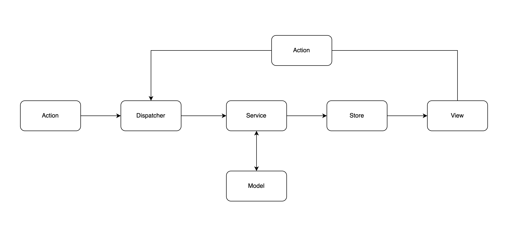

# React Query를 이용한 Flux 패턴과 Clean Architecture 구현에 대한 연구입니다.

## 프로젝트 목적

클린 아키텍처에 기반한 설계를 프론트엔드에 적용한다.\
Flux 패턴으로 React에서 정의하는 데이터의 흐름을 따른다.\
각 위치의 책임과 역할을 분명하게 나눠 코드의 가독성과 유지보수성을 높인다.

이 프로젝트에서는 React Query를 이용해 데이터 관리한다.

클린 아키텍쳐의 모든 부분을 적용하지 않고, 일부 차용하여 프로젝트를 진행한다.\
*사실 이걸 클린 아키텍쳐라 불러도 될지 모르곘다.*

## 프로젝트 구조

```
src
├── assets // 이미지, 스타일 등의 정적 파일
├── core // 각 인터페이스 정의
│   ├── entity
│   │   ├── Post.ts
│   │   └── ...
│   ├── model
│   │   ├── PostModel.d.ts
│   │   └── ...
│   ├── module
│   │   ├── RequestModule.ts
│   └── service
│       ├── PostService.ts
│       └── ...
├── hook // 커스텀 훅 정의, service를 커스텀 훅으로 정의한다.
│   ├── usePost.ts
│   └── ...
├── model // 외부 등에서 데이터를 가져올 모델 정의
│   ├── RequestModule.ts
│   └── ...
├── module // 어뎁테 영역으로
├── page // 페이지 컴포넌트
│   ├── PostListPage.tsx
│   ├── PostDetailPage.tsx
│   └── ...
├── route // 라우팅
├── util // 비지니스 로직에 해당하지 않는 유틸리티 함수
└── App.tsx
```

다음과 같은 프로젝트 구조를 가진다.
프로젝트 구조는 크게 3가지로 나뉜다.

### 1. View
유저들이 직접 상호작용하는 영역이다.\
페이지 컴포넌트와 다른 컴포넌트들로 구성된다.

### 2. Service
비지니스 로직을 담당하는 영역이다.\
유저의 액션 등에 의해서 데이터를 가져오거나 변경하는 등의 usecase에 해당하는 로직을 담당한다.

### 3. model
외부에서 데이터를 가져오거나 저장하는 등의 모델을 정의한다.\
외부에서 가져온 데이터를 가공하거나 저장하는 등의 로직을 담당한다.

큰 데이터의 흐름은 다음과 같다.



액션이 발생하면 View에서 Service로 요청을 보내고, Service는 Model을 통해 데이터를 가져오거나 저장한다.\
그 결과가 Store에 저장되고, View는 Store의 상태를 구독하여 화면을 갱신한다.\
*\*이 프로젝트에서 Store의 역할은 React Query가 대신한다.* 

### 사용한 라이브러리

- React Query
- React Router Dom
